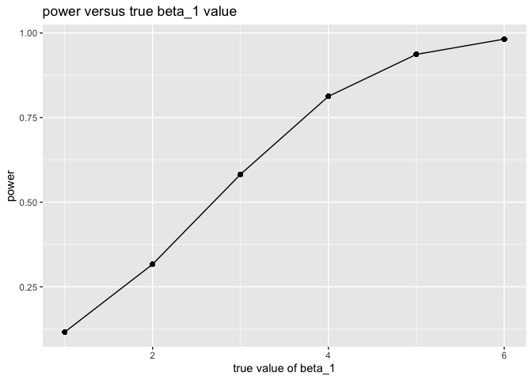

p8105\_hw5\_wz2506
================
Weiran Zhang
11/9/2019

**Problem 1**

``` r
library(tidyverse)
```

    ## ─ Attaching packages ───────────────── tidyverse 1.2.1 ─

    ## ✔ ggplot2 3.2.1     ✔ purrr   0.3.2
    ## ✔ tibble  2.1.3     ✔ dplyr   0.8.3
    ## ✔ tidyr   1.0.0     ✔ stringr 1.4.0
    ## ✔ readr   1.3.1     ✔ forcats 0.4.0

    ## ─ Conflicts ────────────────── tidyverse_conflicts() ─
    ## ✖ dplyr::filter()         masks stats::filter()
    ## ✖ readr::guess_encoding() masks rvest::guess_encoding()
    ## ✖ dplyr::lag()            masks stats::lag()
    ## ✖ purrr::pluck()          masks rvest::pluck()

``` r
set.seed(10)

iris_with_missing = iris %>% 
  map_df(~replace(.x, sample(1:150, 20), NA)) %>%
  mutate(Species = as.character(Species))

iris_with_missing
```

    ## # A tibble: 150 x 5
    ##    Sepal.Length Sepal.Width Petal.Length Petal.Width Species
    ##           <dbl>       <dbl>        <dbl>       <dbl> <chr>  
    ##  1          5.1         3.5          1.4         0.2 setosa 
    ##  2          4.9         3            1.4         0.2 setosa 
    ##  3          4.7         3.2          1.3         0.2 setosa 
    ##  4          4.6         3.1          1.5        NA   setosa 
    ##  5          5           3.6          1.4         0.2 setosa 
    ##  6          5.4         3.9          1.7         0.4 setosa 
    ##  7         NA           3.4          1.4         0.3 setosa 
    ##  8          5           3.4          1.5         0.2 setosa 
    ##  9          4.4         2.9          1.4         0.2 setosa 
    ## 10          4.9         3.1         NA           0.1 setosa 
    ## # … with 140 more rows

``` r
##Function replacing missing values
replace_missing = function(x) {
  if (is.numeric(x)) {
    replace(x, is.na(x), mean(x, na.rm = TRUE))
  } else if(is.character(x)){
    replace(x, is.na(x), "virginica")
  }
}
```

``` r
output = vector("list", length = 5) ##define an output list
for (i in 1:5) {
  output[[i]] = replace_missing(iris_with_missing[[i]])
  } ##for-loop apply the function
output = map(iris_with_missing, replace_missing)
as_tibble(output) ##make the output an an tidied table form
```

    ## # A tibble: 150 x 5
    ##    Sepal.Length Sepal.Width Petal.Length Petal.Width Species
    ##           <dbl>       <dbl>        <dbl>       <dbl> <chr>  
    ##  1         5.1          3.5         1.4         0.2  setosa 
    ##  2         4.9          3           1.4         0.2  setosa 
    ##  3         4.7          3.2         1.3         0.2  setosa 
    ##  4         4.6          3.1         1.5         1.19 setosa 
    ##  5         5            3.6         1.4         0.2  setosa 
    ##  6         5.4          3.9         1.7         0.4  setosa 
    ##  7         5.82         3.4         1.4         0.3  setosa 
    ##  8         5            3.4         1.5         0.2  setosa 
    ##  9         4.4          2.9         1.4         0.2  setosa 
    ## 10         4.9          3.1         3.77        0.1  setosa 
    ## # … with 140 more rows

**Problem 2**

``` r
files = as.data.frame(list.files(path = "./data/", pattern = "*.csv"))
colnames(files) = "file_names"

files
```

    ##    file_names
    ## 1  con_01.csv
    ## 2  con_02.csv
    ## 3  con_03.csv
    ## 4  con_04.csv
    ## 5  con_05.csv
    ## 6  con_06.csv
    ## 7  con_07.csv
    ## 8  con_08.csv
    ## 9  con_09.csv
    ## 10 con_10.csv
    ## 11 exp_01.csv
    ## 12 exp_02.csv
    ## 13 exp_03.csv
    ## 14 exp_04.csv
    ## 15 exp_05.csv
    ## 16 exp_06.csv
    ## 17 exp_07.csv
    ## 18 exp_08.csv
    ## 19 exp_09.csv
    ## 20 exp_10.csv

``` r
read_file = function(file_names){
  read_csv(paste0("./data/", file_names))
}

output = purrr::map(files$file_names, read_file)
```

    ## Parsed with column specification:
    ## cols(
    ##   week_1 = col_double(),
    ##   week_2 = col_double(),
    ##   week_3 = col_double(),
    ##   week_4 = col_double(),
    ##   week_5 = col_double(),
    ##   week_6 = col_double(),
    ##   week_7 = col_double(),
    ##   week_8 = col_double()
    ## )
    ## Parsed with column specification:
    ## cols(
    ##   week_1 = col_double(),
    ##   week_2 = col_double(),
    ##   week_3 = col_double(),
    ##   week_4 = col_double(),
    ##   week_5 = col_double(),
    ##   week_6 = col_double(),
    ##   week_7 = col_double(),
    ##   week_8 = col_double()
    ## )
    ## Parsed with column specification:
    ## cols(
    ##   week_1 = col_double(),
    ##   week_2 = col_double(),
    ##   week_3 = col_double(),
    ##   week_4 = col_double(),
    ##   week_5 = col_double(),
    ##   week_6 = col_double(),
    ##   week_7 = col_double(),
    ##   week_8 = col_double()
    ## )
    ## Parsed with column specification:
    ## cols(
    ##   week_1 = col_double(),
    ##   week_2 = col_double(),
    ##   week_3 = col_double(),
    ##   week_4 = col_double(),
    ##   week_5 = col_double(),
    ##   week_6 = col_double(),
    ##   week_7 = col_double(),
    ##   week_8 = col_double()
    ## )
    ## Parsed with column specification:
    ## cols(
    ##   week_1 = col_double(),
    ##   week_2 = col_double(),
    ##   week_3 = col_double(),
    ##   week_4 = col_double(),
    ##   week_5 = col_double(),
    ##   week_6 = col_double(),
    ##   week_7 = col_double(),
    ##   week_8 = col_double()
    ## )
    ## Parsed with column specification:
    ## cols(
    ##   week_1 = col_double(),
    ##   week_2 = col_double(),
    ##   week_3 = col_double(),
    ##   week_4 = col_double(),
    ##   week_5 = col_double(),
    ##   week_6 = col_double(),
    ##   week_7 = col_double(),
    ##   week_8 = col_double()
    ## )
    ## Parsed with column specification:
    ## cols(
    ##   week_1 = col_double(),
    ##   week_2 = col_double(),
    ##   week_3 = col_double(),
    ##   week_4 = col_double(),
    ##   week_5 = col_double(),
    ##   week_6 = col_double(),
    ##   week_7 = col_double(),
    ##   week_8 = col_double()
    ## )
    ## Parsed with column specification:
    ## cols(
    ##   week_1 = col_double(),
    ##   week_2 = col_double(),
    ##   week_3 = col_double(),
    ##   week_4 = col_double(),
    ##   week_5 = col_double(),
    ##   week_6 = col_double(),
    ##   week_7 = col_double(),
    ##   week_8 = col_double()
    ## )
    ## Parsed with column specification:
    ## cols(
    ##   week_1 = col_double(),
    ##   week_2 = col_double(),
    ##   week_3 = col_double(),
    ##   week_4 = col_double(),
    ##   week_5 = col_double(),
    ##   week_6 = col_double(),
    ##   week_7 = col_double(),
    ##   week_8 = col_double()
    ## )
    ## Parsed with column specification:
    ## cols(
    ##   week_1 = col_double(),
    ##   week_2 = col_double(),
    ##   week_3 = col_double(),
    ##   week_4 = col_double(),
    ##   week_5 = col_double(),
    ##   week_6 = col_double(),
    ##   week_7 = col_double(),
    ##   week_8 = col_double()
    ## )
    ## Parsed with column specification:
    ## cols(
    ##   week_1 = col_double(),
    ##   week_2 = col_double(),
    ##   week_3 = col_double(),
    ##   week_4 = col_double(),
    ##   week_5 = col_double(),
    ##   week_6 = col_double(),
    ##   week_7 = col_double(),
    ##   week_8 = col_double()
    ## )
    ## Parsed with column specification:
    ## cols(
    ##   week_1 = col_double(),
    ##   week_2 = col_double(),
    ##   week_3 = col_double(),
    ##   week_4 = col_double(),
    ##   week_5 = col_double(),
    ##   week_6 = col_double(),
    ##   week_7 = col_double(),
    ##   week_8 = col_double()
    ## )
    ## Parsed with column specification:
    ## cols(
    ##   week_1 = col_double(),
    ##   week_2 = col_double(),
    ##   week_3 = col_double(),
    ##   week_4 = col_double(),
    ##   week_5 = col_double(),
    ##   week_6 = col_double(),
    ##   week_7 = col_double(),
    ##   week_8 = col_double()
    ## )
    ## Parsed with column specification:
    ## cols(
    ##   week_1 = col_double(),
    ##   week_2 = col_double(),
    ##   week_3 = col_double(),
    ##   week_4 = col_double(),
    ##   week_5 = col_double(),
    ##   week_6 = col_double(),
    ##   week_7 = col_double(),
    ##   week_8 = col_double()
    ## )
    ## Parsed with column specification:
    ## cols(
    ##   week_1 = col_double(),
    ##   week_2 = col_double(),
    ##   week_3 = col_double(),
    ##   week_4 = col_double(),
    ##   week_5 = col_double(),
    ##   week_6 = col_double(),
    ##   week_7 = col_double(),
    ##   week_8 = col_double()
    ## )
    ## Parsed with column specification:
    ## cols(
    ##   week_1 = col_double(),
    ##   week_2 = col_double(),
    ##   week_3 = col_double(),
    ##   week_4 = col_double(),
    ##   week_5 = col_double(),
    ##   week_6 = col_double(),
    ##   week_7 = col_double(),
    ##   week_8 = col_double()
    ## )
    ## Parsed with column specification:
    ## cols(
    ##   week_1 = col_double(),
    ##   week_2 = col_double(),
    ##   week_3 = col_double(),
    ##   week_4 = col_double(),
    ##   week_5 = col_double(),
    ##   week_6 = col_double(),
    ##   week_7 = col_double(),
    ##   week_8 = col_double()
    ## )
    ## Parsed with column specification:
    ## cols(
    ##   week_1 = col_double(),
    ##   week_2 = col_double(),
    ##   week_3 = col_double(),
    ##   week_4 = col_double(),
    ##   week_5 = col_double(),
    ##   week_6 = col_double(),
    ##   week_7 = col_double(),
    ##   week_8 = col_double()
    ## )
    ## Parsed with column specification:
    ## cols(
    ##   week_1 = col_double(),
    ##   week_2 = col_double(),
    ##   week_3 = col_double(),
    ##   week_4 = col_double(),
    ##   week_5 = col_double(),
    ##   week_6 = col_double(),
    ##   week_7 = col_double(),
    ##   week_8 = col_double()
    ## )
    ## Parsed with column specification:
    ## cols(
    ##   week_1 = col_double(),
    ##   week_2 = col_double(),
    ##   week_3 = col_double(),
    ##   week_4 = col_double(),
    ##   week_5 = col_double(),
    ##   week_6 = col_double(),
    ##   week_7 = col_double(),
    ##   week_8 = col_double()
    ## )

``` r
file_nest = 
  files %>%
  mutate(data = output) %>%
  unnest()
```

    ## Warning: `cols` is now required.
    ## Please use `cols = c(data)`

``` r
file_nest ##dataframe with file names and data in each files
```

    ## # A tibble: 20 x 9
    ##    file_names week_1 week_2 week_3 week_4 week_5 week_6 week_7 week_8
    ##    <fct>       <dbl>  <dbl>  <dbl>  <dbl>  <dbl>  <dbl>  <dbl>  <dbl>
    ##  1 con_01.csv   0.2  -1.31    0.66   1.96   0.23   1.09   0.05   1.94
    ##  2 con_02.csv   1.13 -0.88    1.07   0.17  -0.83  -0.31   1.58   0.44
    ##  3 con_03.csv   1.77  3.11    2.22   3.26   3.31   0.89   1.88   1.01
    ##  4 con_04.csv   1.04  3.66    1.22   2.33   1.47   2.7    1.87   1.66
    ##  5 con_05.csv   0.47 -0.580  -0.09  -1.37  -0.32  -2.17   0.45   0.48
    ##  6 con_06.csv   2.37  2.5     1.59  -0.16   2.08   3.07   0.78   2.35
    ##  7 con_07.csv   0.03  1.21    1.13   0.64   0.49  -0.12  -0.07   0.46
    ##  8 con_08.csv  -0.08  1.42    0.09   0.36   1.18  -1.16   0.33  -0.44
    ##  9 con_09.csv   0.08  1.24    1.44   0.41   0.95   2.75   0.3    0.03
    ## 10 con_10.csv   2.14  1.15    2.52   3.44   4.26   0.97   2.73  -0.53
    ## 11 exp_01.csv   3.05  3.67    4.84   5.8    6.33   5.46   6.38   5.91
    ## 12 exp_02.csv  -0.84  2.63    1.64   2.58   1.24   2.32   3.11   3.78
    ## 13 exp_03.csv   2.15  2.08    1.82   2.84   3.36   3.61   3.37   3.74
    ## 14 exp_04.csv  -0.62  2.54    3.78   2.73   4.49   5.82   6      6.49
    ## 15 exp_05.csv   0.7   3.33    5.34   5.57   6.9    6.66   6.24   6.95
    ## 16 exp_06.csv   3.73  4.08    5.4    6.41   4.87   6.09   7.66   5.83
    ## 17 exp_07.csv   1.18  2.35    1.23   1.17   2.02   1.61   3.13   4.88
    ## 18 exp_08.csv   1.37  1.43    1.84   3.6    3.8    4.72   4.68   5.7 
    ## 19 exp_09.csv  -0.4   1.08    2.66   2.7    2.8    2.64   3.51   3.27
    ## 20 exp_10.csv   1.09  2.8     2.8    4.3    2.25   6.57   6.09   4.64

``` r
##Tidy the dataset

file_tidy = file_nest %>%
  pivot_longer(week_1:week_8,
               names_to = "week",
               values_to = "data") %>%
  mutate(files = str_remove(file_names, ".csv"),
         week = str_remove(week, "week_")) %>%
  separate(file_names, into = c("group", "subject_id"), sep = "_") %>%
  mutate(group = recode(group, "con" = "control", "exp" = "experimental")) 

file_tidy
```

    ## # A tibble: 160 x 5
    ##    group   subject_id week   data files 
    ##    <chr>   <chr>      <chr> <dbl> <chr> 
    ##  1 control 01.csv     1      0.2  con_01
    ##  2 control 01.csv     2     -1.31 con_01
    ##  3 control 01.csv     3      0.66 con_01
    ##  4 control 01.csv     4      1.96 con_01
    ##  5 control 01.csv     5      0.23 con_01
    ##  6 control 01.csv     6      1.09 con_01
    ##  7 control 01.csv     7      0.05 con_01
    ##  8 control 01.csv     8      1.94 con_01
    ##  9 control 02.csv     1      1.13 con_02
    ## 10 control 02.csv     2     -0.88 con_02
    ## # … with 150 more rows

``` r
ggplot(file_tidy, aes(x = week, y = data, color = subject_id, group = subject_id)) +
  geom_point() +
  geom_line() +
  labs(title = "observations on each subject over time",
       x = "week",
       y = "observations") +
  facet_grid(~group)
```

<!-- -->

Comment: For control arm spaghetti plot, we can see that the
observations are more concentrated in an interval. For experimental arm,
we can see that the observations are more spread out; also the
observations for experimental arm are relatively higher than in the
control arm.

**Problem 3**

``` r
regression = function(n = 30, beta0 = 2, beta1) {
  df = tibble(
    x = rnorm(30, mean = 0, sd = 1),
    y = beta0 + beta1 * x + rnorm(30, 0, sqrt(50))
  )
  fit = lm(y ~ x, data = df)
  tidy_fit = broom::tidy(fit)
  tibble(
    beta1_hat = tidy_fit$estimate[2],
    p_value = tidy_fit$p.value[2]
  )
}
```

Generate 10000 datasets from the model when \(\beta_1\) = 0

``` r
set.seed(10)
output_b1 = rerun(100, regression(beta1 = 0)) %>%
  bind_rows()

head(output_b1)
```

    ## # A tibble: 6 x 2
    ##   beta1_hat p_value
    ##       <dbl>   <dbl>
    ## 1    -2.44   0.0895
    ## 2    -0.366  0.769 
    ## 3     2.10   0.0917
    ## 4    -0.963  0.431 
    ## 5     1.61   0.192 
    ## 6     0.213  0.880

Generate 10000 datasets from the model for \(\beta_1\) =
{1,2,3,4,5,6}

``` r
beta_value = list("beta1_1"  = 1, "beta1_2"  = 2, "beta1_3"  = 3, "beta1_4"  = 4, "beta1_5"  = 5, "beta1_6"  = 6)

output = vector("list", length = 6)

for (i in 1:6) {
  output[[i]] = rerun(10000, regression(beta1 = beta_value[[i]])) %>%
    bind_rows
}
```

``` r
sim_results = 
  tibble(beta1_value = c(1,2,3,4,5,6)) %>%
  mutate(output_lists = map(.x = beta1_value, ~rerun(10000, regression(beta1 = .x))),
         estimate_dfs = map(output_lists, bind_rows) 
  ) %>%
  select(-output_lists) %>%
  unnest(estimate_dfs)

head(sim_results)
```

    ## # A tibble: 6 x 3
    ##   beta1_value beta1_hat p_value
    ##         <dbl>     <dbl>   <dbl>
    ## 1           1     2.74    0.146
    ## 2           1     1.94    0.337
    ## 3           1    -0.566   0.713
    ## 4           1     0.577   0.689
    ## 5           1    -1.14    0.408
    ## 6           1     1.06    0.409

``` r
rejectnull_proportion = sim_results %>%
  filter(p_value < 0.05) %>%
  group_by(beta1_value) %>%
  mutate(power = n()/10000)

ggplot(rejectnull_proportion, aes(x = beta1_value, y = power)) +
  geom_point() +
  geom_line() +
  labs(title = "power versus true beta_1 value",
       x = "true value of beta_1",
       y = "power")
```

<!-- -->

Association between effect size and power: Assume the effect size is the
difference between true beta\_1 value and zero which is the value of
true beta\_1 value. From the plot, we can see that as the effect size
increases, the power also increases. Thus, power and the effect size are
positively correlated.

``` r
##Plot of average estimate of beta1 hat versus beta1 value
beta_mean = sim_results %>%
  group_by(beta1_value) %>%
  mutate(mean = mean(beta1_hat))

plot1 = ggplot(beta_mean, aes(x = beta1_value, y = mean)) +
  geom_point() +
  geom_line() +
  labs(title = "average estimate of beta_1_hat",
       x = "beta1",
       y = "average estimate of beta_1")

plot1
```

<!-- -->

``` r
##Plot of average estimate of beta1 hat versus beta1 value only in sample for which null was rejected
beta_mean_rejectnull = rejectnull_proportion %>%
  mutate(mean_rejectnull = mean(beta1_hat))

plot2 = ggplot(beta_mean_rejectnull, aes(x = beta1_value, y = mean_rejectnull)) +
  geom_point() +
  geom_line() +
  labs(title = "average estimate of beta_1_hat only in samples for which the null was rejected",
       x = "beta1",
       y = "average estimate")

plot2
```

<!-- -->

``` r
plot = plot1 + 
  geom_point(data = beta_mean_rejectnull, aes(x = beta1_value, y = mean_rejectnull), color = "blue") +
  geom_line(data = beta_mean_rejectnull, aes(x = beta1_value, y = mean_rejectnull), color = "blue") +
  labs(title = "average estimate under two conditions",
       x = "beta1",
       y = "average estimate")

plot
```

<!-- -->

From the plot we can see that sample average of beta\_1\_hat does not
equal to the true beta\_1 value. The difference between the two values
is large when effect size is small and the difference decreases when the
effect size increases. Since as the effect size increases, the power
also increases and the number of tests that reject the null also
increases. And then the difference between the two values becomes
smaller.
